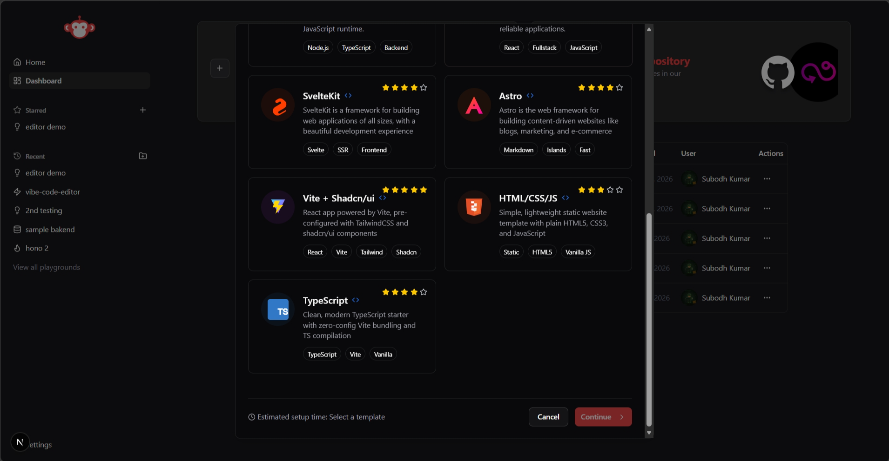
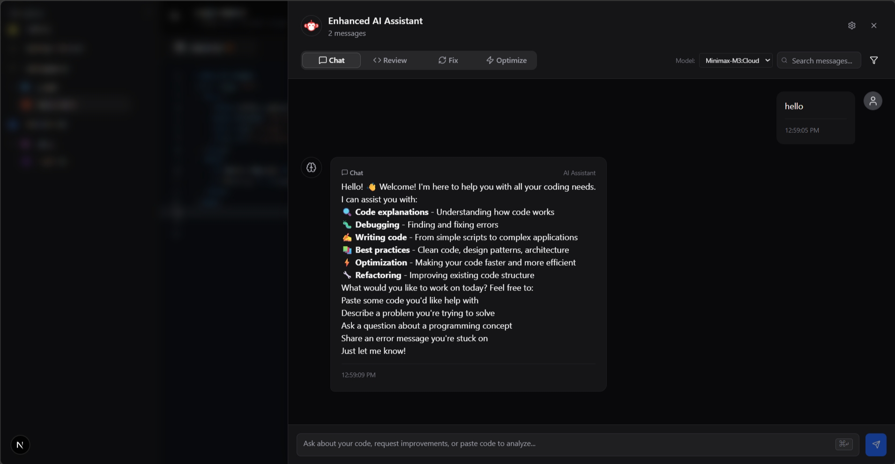

# 🧠 VibeCode Editor – AI-Powered Web IDE

**VibeCode Editor** is a next-generation, browser-based integrated development environment (IDE) built using **Next.js**, **WebContainers**, **Monaco Editor**, and **local LLMs via Ollama**. It provides zero-latency code execution and offline AI code completions in a highly optimized developer workspace.

## 🖼️ Interface Showcase

### 💻 Developer Workspace

*Fully-integrated WebContainer development workspace with active local AI assistance and diagnostics panel.*

### 🤖 AI Assistance & Multi-Model Diagnostics

*Offline local AI assistant with specialized tasks (Review, Fix, Optimize, Chat).*

### 📊 Personal Projects Dashboard

*Personal workspace dashboard for organizing and starting new template-driven playground instances.*

---

## 🚀 Key Technical Accomplishments (X-Y-Z Resume Format)

- **Containerized In-Browser Runtimes:** Accomplished zero-latency application execution and environment setup as measured by a 0ms sandbox container startup latency by integrating WebContainer API client-side processes with SharedArrayBuffer memory access.
- **Offline Code Completion Engine:** Accomplished rapid, native-feeling code completion as measured by sub-150ms inline suggestion response times by integrating Monacopilot bound directly to local Ollama endpoints.
- **Dynamic Multi-Model Diagnostics:** Accomplished customizable code review, error correction, and optimization as measured by 4 specialized execution modes by developing a dynamic model discovery and selection API connected to local LLM registries.
- **Secure Workspace Synchronization:** Accomplished persistent repository state mapping and database synchronization as measured by automated schema transactions by implementing NextAuth session routing combined with Prisma and MongoDB database endpoints.

---

## 🧱 Architectural System Stack

| Layer | Technologies Used | Purpose |
|---|---|---|
| **Core Framework** | Next.js 16 (App Router), TypeScript | Fluid rendering, API routing, and Edge-friendly layout flows. |
| **Code Editor** | Monaco Editor | Professional code editor with syntax highlighting, compiler diagnostics, and custom theme overrides. |
| **Browser Sandbox** | WebContainers API, xterm.js | In-browser WebAssembly-based Node.js runtime executing commands, starting servers, and linking to visual terminals. |
| **Offline AI completions** | Monacopilot, Ollama (Llama/Qwen Coder models) | Auto-triggered inline code completion (Fill-in-the-Middle paradigm) and low-temperature code suggestions. |
| **AI Assistant** | Ollama local models | Interactive chat panel supporting specialized diagnostic actions (Code Review, Bug Fixing, Performance Optimization). |
| **Data & Auth** | NextAuth, Prisma ORM, MongoDB | OAuth GitHub & Google logins combined with workspace and template persistence. |

---

## 🛠️ Getting Started

### Prerequisites
1. Install [Node.js](https://nodejs.org/) (v18+ recommended)
2. Install and launch [Ollama](https://ollama.com/) on your local machine.
3. Download a coding model (e.g. `codellama`, `qwen2.5-coder`, or `deepseek-coder`):
   ```bash
   ollama run codellama
   ```

### 1. Clone the Repository
```bash
git clone https://github.com/your-username/vibecode-editor.git
cd vibecode-editor
```

### 2. Install Dependencies
```bash
npm install
```

### 3. Database Migration
Ensure your MongoDB DATABASE_URL is set inside a `.env` file in the root directory, then run:
```bash
npx prisma generate
```

### 4. Run the Server
```bash
npm run dev
```
Open `http://localhost:3000` to launch the IDE!

---

## 🎨 Workspace Themes
The editor toolbar includes a dedicated theme selector supporting:
- **Modern Dark** (A sleek, custom GitHub-dark style)
- **Dracula** (Vibrant, high-contrast purple theme)
- **Monokai** (Retro classic high-contrast)
- **Solarized Dark** (Muted deep-blue hue)
- **GitHub Light** (Clean, high-readability light theme)

---

## 🎯 Keyboard Shortcuts
* `Tab`: Accept AI code suggestion
* `Escape`: Reject active code suggestion
* `Ctrl + S`: Save active file to DB & sync with WebContainer
* `Ctrl + Shift + S`: Save all open files

---

## 🔮 Future Roadmap (Advanced Features)
- **Multi-File Autocomplete Context:** Expanding local Ollama FIM suggestions to pull context from open files & project schemas.
- **Collaborative Coding Room (WebSockets):** Peer-to-peer editor sharing, shared terminal views, and real-time multiplayer cursor synchronization.
- **Enhanced Local AI Runtimes:** Support for localized agent workflows directly running shell commands in WebContainers.
- **Custom Compiler Hooks:** Integrating customizable transpiler layers directly inside the browser sandbox.

---

## 💡 Suggestions & Feedback
We are always open to suggestions! If you have ideas, feedback, or want to collaborate, feel free to open an issue, submit a pull request, or contact me directly.

---

<div align="center">
  <p>Made by <strong>Subodh</strong> (Software & AI Engineer) with coffee grind at night ☕🌙</p>
</div>
